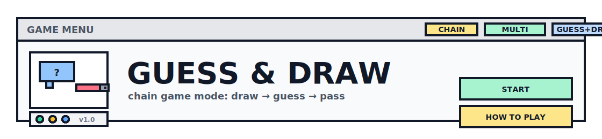

  <picture>
    <source media="(prefers-color-scheme: dark)" srcset="figure/logo-dark.svg">
    
  </picture>

## Key Features
- Real-time drawing with WebSocket
- AI-assisted answer judgment
- Room management system
- Scoring system
- Chain mode (Telephone-style: draw → guess → next player continues)

## Technology Stack
Frontend:
- React.js
- WebSocket
- HTML5 Canvas

Backend:
- FastAPI
- WebSocket
- OpenAI API

## System Architecture
### Main Frontend Components

1. **RoomManagement - Room Management Component**
   - Create a room
   - Join a room
   - Set room parameters (rounds/time/AI judge etc.)

2. **DrawingCanvas - Drawing Component**
   - HTML5 Canvas drawing functionality
   - Pen/Eraser tools
   - Brush size/color selection
   - Clear canvas (optional)

3. **Viewer - Viewer Component**
   - View real-time drawing
   - Submit guesses
   - View round status / score updates

4. **Judge - Judging Component**
   - Display AI judgment results
   - Manual confirmation of judgment (optional)

### Main Backend Modules

1. **websocket.py - WebSocket Management**
   - Manage WebSocket connections (connect/disconnect)
   - Broadcast messages to a room
   - Route messages by event type

2. **game.py - Game Logic**
   - Room state (players/round/role)
   - Round control (start/end/next)
   - Guess checking & scoring
   - AI judge integration (optional)

## Game Flow
1. **Create / Join Room**
   - Host creates a room and sets parameters
   - Players join by room id

2. **Game Start**
   - Host starts the game
   - Backend initializes player list, scores, and round info

3. **Round Start**
   - Backend selects the drawer for this round
   - Drawer receives the word (others do not)
   - Guessers enter guessing mode

4. **Drawing Sync**
   - Drawer draws on Canvas
   - Frontend sends drawing strokes via WebSocket
   - Backend broadcasts strokes to all players in the same room

5. **Guess Submit**
   - Guessers submit answers through WebSocket
   - Backend checks correctness:
     - exact match / normalized match (optional)
     - AI judgment (optional)

6. **Judgment & Score**
   - If correct: update score and broadcast score update
   - If uncertain (optional): send to Judge panel for manual confirm

7. **Round End → Next Round**
   - Round ends when time is up or someone guesses correctly (based on rules)
   - Backend starts next round until all rounds finish

8. **Game End**
   - Broadcast final scoreboard and winner

## API Documentation

### WebSocket Events
> Message format (recommended): `{ "type": "...", "roomId": "...", "payload": {...} }`

Client -> Server
- `ROOM_CREATE`
  - payload: `{"userName":"...", "settings":{"rounds":..., "roundTime":..., "enableAI":...}}`
- `ROOM_JOIN`
  - payload: `{"userName":"..."}`
- `ROOM_LEAVE`
  - payload: `{}`
- `GAME_START`
  - payload: `{}`
- `DRAW_STROKE`
  - payload: `{"tool":"pen|eraser","color":"#000000","size":6,"points":[[x1,y1],[x2,y2],...] }`
- `CANVAS_CLEAR`
  - payload: `{}`
- `GUESS_SUBMIT`
  - payload: `{"guess":"..."}`
- `JUDGE_CONFIRM` (optional)
  - payload: `{"guessId":"...", "result":true|false}`

Server -> Client
- `ROOM_CREATED`
  - payload: `{"roomId":"...","host":"...","settings":{...}}`
- `ROOM_STATE`
  - payload: `{"players":[...],"status":"waiting|playing","scores":{...}}`
- `ROUND_START`
  - payload: `{"round":1,"drawer":"...","timeLimit":...,"hint":"..."}`
  - (drawer only, optional): `{"answer":"..."}`
- `DRAW_BROADCAST` (or reuse `DRAW_STROKE`)
  - payload: same as `DRAW_STROKE`
- `GUESS_BROADCAST` (optional)
  - payload: `{"userName":"...","guess":"..."}`
- `JUDGE_RESULT`
  - payload: `{"guess":"...","answer":"...","correct":true|false,"confidence":0~1,"reason":"..."}`
- `SCORE_UPDATE`
  - payload: `{"scores":{...}}`
- `ROUND_END`
  - payload: `{"round":1,"answer":"..."}`
- `GAME_END`
  - payload: `{"finalScores":{...},"winner":"..."}`
- `ERROR`
  - payload: `{"message":"..."}`

### REST API
- `GET /health`
  - response: `{"status":"ok"}`
- `GET /rooms/{roomId}` (optional)
  - response: `{"roomId":"...","players":[...],"status":"...","scores":{...}}`

## Deployment
Local Development
- Backend (FastAPI)
  - Install: `pip install -r requirements.txt`
  - Run (example): `uvicorn main:app --reload --host 0.0.0.0 --port 8000`
- Frontend (React)
  - Install: `cd frontend && npm install`
  - Run: `npm run dev` (or `npm start`)

Production (recommended)
- Build frontend: `cd frontend && npm run build`
- Use Nginx/Reverse Proxy for HTTP + WebSocket upgrade (wss:// recommended)

## Configuration
Environment Variables (optional)
- `OPENAI_API_KEY` (required if AI judgment enabled)
- `OPENAI_BASE_URL` (optional)
- `OPENAI_MODEL` (optional)
- `BACKEND_HOST` (default: `0.0.0.0`)
- `BACKEND_PORT` (default: `8000`)
- `CORS_ORIGINS` (frontend origin list)

Example `.env`
- `OPENAI_API_KEY=YOUR_KEY`
- `OPENAI_BASE_URL=https://api.openai.com/v1`
- `OPENAI_MODEL=gpt-4o-mini`
- `BACKEND_HOST=0.0.0.0`
- `BACKEND_PORT=8000`
- `CORS_ORIGINS=http://localhost:5173,http://localhost:3000`

## TODO
- Improve chain rules (how the next round word/hint is generated)
- Add word bank (difficulty/categories/custom words)
- Optimize drawing sync (throttle/compress points)
- Add undo/redo and more tools
- Add spectator mode and better room UI
- Add Docker / docker-compose
- Add reconnect handling and better logs
- Add tests (unit + WebSocket E2E)

## Contributors

- Backend Engineer:
- Frontend Engineer:
